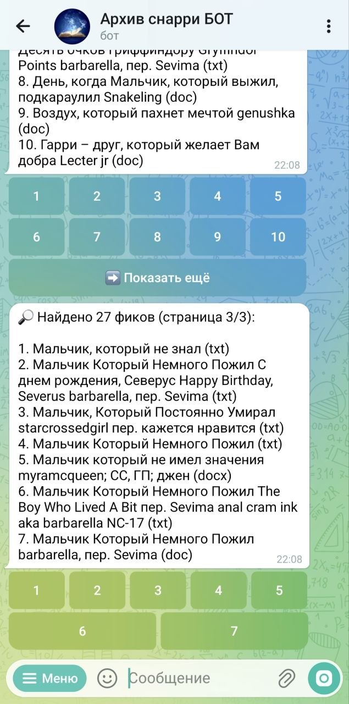
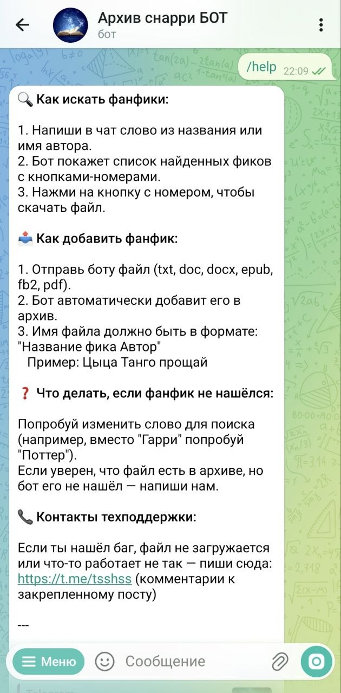
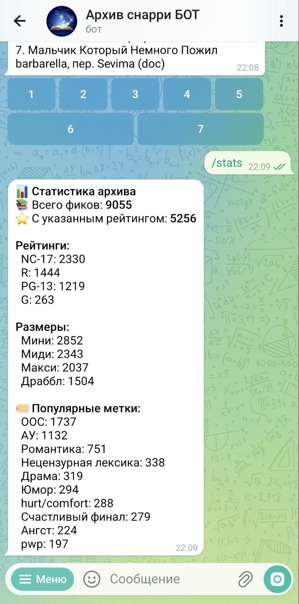
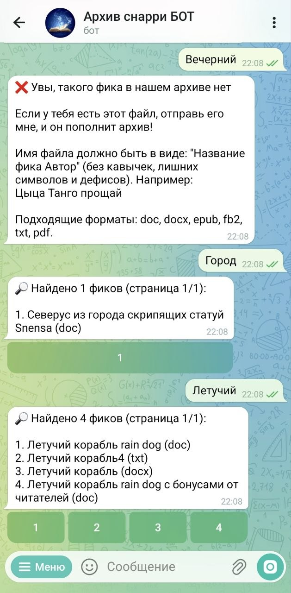

# 📚 Fanfics Archive Bot

A Telegram bot for searching and archiving fanfiction.  
Search by title, author, rating, size, and tags. Upload new works and view archive statistics.

**Pet project created as part of learning Python development.**

## ✨ Features

- 🔎 **Full-text search** by title, author, and content (FTS5)
- ⭐ **Advanced search** with filters by rating, size, and tags
- 📤 **File upload** to expand the archive
- 📊 **Archive statistics**: fic count, ratings, popular tags
- 🧠 **Metadata parsing** from file headers (rating, size, tags)
- 🗂️ **Paginated results** with inline buttons

## 🛠 Tech Stack

| Technology        | Description                          |
|-------------------|--------------------------------------|
| Python 3.10+      | Core language                        |
| aiogram 3.x       | Telegram Bot API framework           |
| SQLite + FTS5     | Database with full-text search       |
| python-dotenv     | Environment variables from `.env`    |
| python-docx       | Metadata extraction from .docx files |
| ebooklib + bs4    | Parsing .epub and .fb2 files         |

## ⚙️ Installation & Launch

### Prerequisites

- Python 3.10 or higher
- Git installed
- A bot registered via @BotFather

### 1. Clone the repository

`git clone https://github.com/EvanesskoHub/fanfics-archive-bot.git`

`cd fanfics-archive-bot`

### 2. Set up a virtual environment

`python -m venv venv`

`source venv/bin/activate` (Linux/MacOS)

`venv\Scripts\activate` (Windows)

### 3. Install dependencies

`pip install -r requirements.txt`

### 4. Configure environment variables

Create an `.env` file in the project root:

`cp .env.example .env`

Open `.env` and insert your BotFather token:

`BOT_TOKEN=your_telegram_bot_token_here`

### 5. Run the bot

`python bot.py`

## 📁 Project Structure

fanfics-archive-bot/
├── bot.py # Main bot file (handlers, FSM)
├── advanced_search.py # Advanced search with filters
├── config.py # Paths and constants
├── db.py # SQLite connection
├── indexer.py # File indexing and metadata parsing
├── search.py # Search logic and ranking
├── utils.py # Text normalization
├── file_cache.py # File cache for faster sending
├── reindex_all.py # Full reindexing script
├── requirements.txt # Dependencies
├── .env.example # Environment variables template
├── .gitignore # Git ignore rules
└── README.md # This file

## 📸 Screenshots

## 📝 Notes

This project demonstrates:

- Asynchronous Python (aiogram)
- SQLite schema design with FTS5
- Text data parsing
- Dialog interface development (FSM)
- Environment variables and security practices

---

💬 **Contact:** [Telegram](https://t.me/Evanessko) | [Email](mailto:zupinka2004@mail.ru)

---

## 📚 Русская версия / Russian

**Fanfics Archive Bot** — Телеграм-бот для поиска и архивирования фанфиков.

**Функции:** поиск по названию/автору/меткам, загрузка файлов, статистика архива, парсинг метаданных из шапок файлов.

**Стек:** Python, aiogram, SQLite + FTS5.

**Контакты:** [Telegram](https://t.me/Evanessko) | [Email](mailto:zupinka2004@mail.ru)